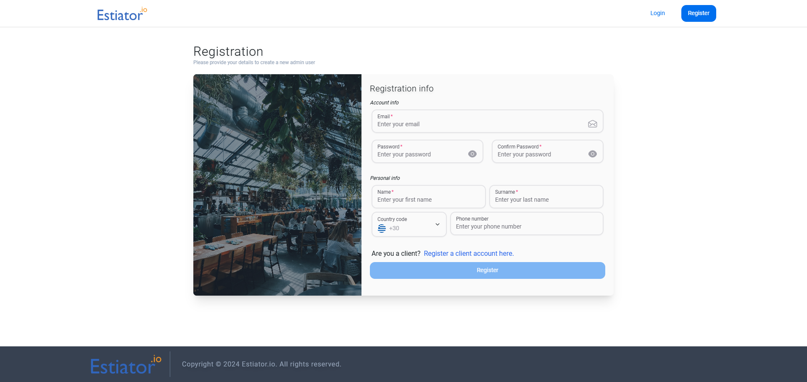
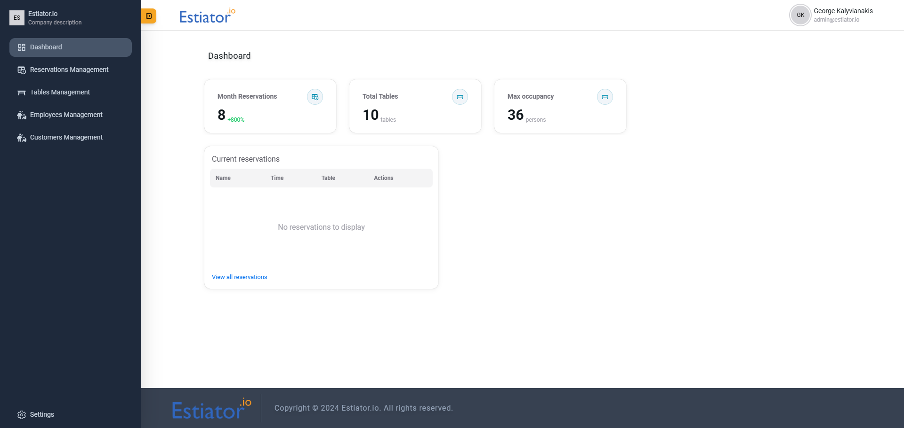
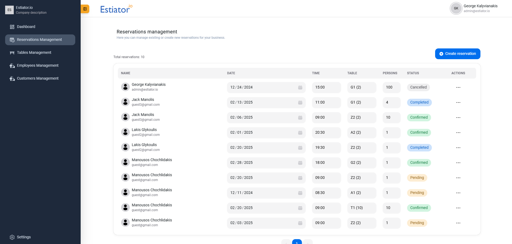
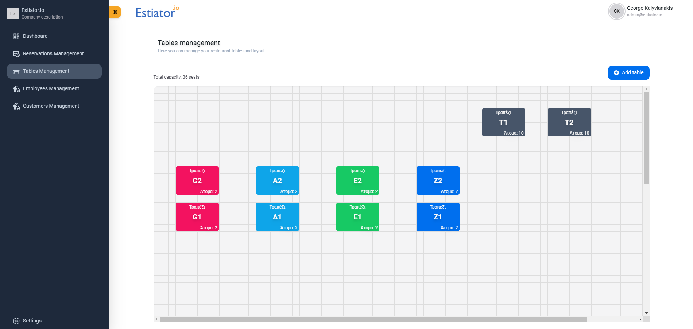
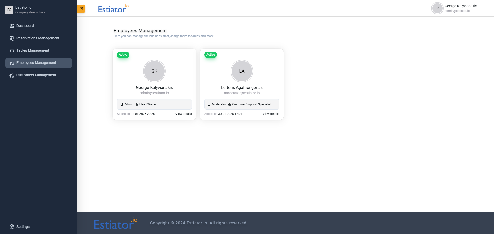

> [!CAUTION]  
> This repository is a work in progress and is not yet stable. Do not use it in any production system.
&nbsp;


<div style="display:flex; gap: 5px; margin-bottom:55px;" align="center">
  
  
  
  
  
</div>
<div style="display:flex; gap: 5px; margin-bottom:55px;" align="center">
  
  
  
</div>
&nbsp;

<p align="center">
   <a href="https://estiator.io" target="_blank">
      
   </a>
</p>
<h6 align="center">
  The <strong>open source</strong> platform for managing <strong>Restaurants</strong> and other <strong>Food & Beverage</strong> businesses. 
</h6>

&nbsp;

# Table of Contents

<details>
  <summary>About</summary>

  - [General](#about-general)  
  - [Tech](#about-tech)  
</details>
<details>
  <summary>Running in Docker</summary>

  - [Intro](#running-in-docker-intro)
  - [Prerequisites](#running-in-docker-prerequisites)  
  - [Build the Server](#running-in-docker-build-the-server)  
  - [Run the Container](#running-in-docker-run-the-container)  
</details>
<details>
  <summary>Development Setup (Without Docker)</summary>

  - [Intro](#development-setup-intro)  
  - [Prerequisites](#development-setup-prerequisites)  
  - [Client](#development-setup-client)  
  - [Server](#development-setup-server)  
</details>
<details>
  <summary>Testing</summary>

  - [Manual](#testing-manual)
</details>
<details>
  <summary>Screenshots</summary>

  - [Intro](#screenshots-intro)
    - [Login page](#login-page)
    - [Register page](#register-page)
    - [Dashboard page](#dashboard-page)
    - [Reservations Management page](#reservations-management-page)
    - [Tables Management page](#tables-management-page)
    - [Employees Management page](#employees-management-page)
    - [Customers Management page](#customers-management-page)
</details>


# About

### About: General 
[Estiator.io](https://estiator.io) is a full-stack web application that will be submitted as part of a master thesis. The intention of the creation of this piece of software is to offer a complete management solution for businesses related to the F&B (Food & Beverage) industry. 

[See screenshots](#screenshots)

### About: Tech
The project uses [**ReactJS 18**](https://react.dev/) with [**HeroUI 2**](https://www.heroui.com/) components library for the client. The server side is implemented using [**Java 22**](https://www.java.com/en/) with [**Spring Boot 3.3** ](https://spring.io/projects/spring-boot). For the persistence, [**MySQL 8**](https://www.mysql.com/) is chosen.


# Running in Docker

### Running in Docker: Intro
The application is fully containerized and therefore you can run it in production mode using `Docker`. 

### Running in Docker: Prerequisites
- **Docker** (download [here](https://www.docker.com/products/docker-desktop/))
- **JDK 21** (download [here](https://www.oracle.com/java/technologies/javase/jdk21-archive-downloads.html))
- **Gradle v ≥ 8.1** (optional) (download [here](https://gradle.org/install/))

We only require `Docker` to be able to build and run the container, but we will also require `JDK 21` because the building of the application server will be a separate step, outside of the `Docker` scope.

### Running in Docker: Build the Server

Once everything is installed, you will need to start a command line on any directory and execute the commands below.

```shell
# 1. Clone the repository
git clone https://github.com/CptGeo/estiator
```

```shell
# 2. Navigate to the project directory
cd estiator.io/server
```

```shell
# 3. Execute build script using gradlew file
./gradlew clean bootJar
```

> [!TIP]
> You can also install `Gradle` and run `gradle clean bootJar` instead, which will give you effectively the same results. Here, `./gradlew` is being used so that you don't need to care about `Gradle` version, as it is specified in the project's `gradle-wrapper.properties` file.

The `.jar` file is now built and it should be located in `/build/libs/` directory with a name similar to `estiator.io-[VERSION]`. This file will be necessary for the next step.

### Running in Docker: Run the Container

Let's suppose you are currently in root directory of the project. Run the following commands: 

```shell
# Build Docker container using docker-compose
docker-compose up --build
```

This command will perform the following actions: 
- Setup `app-database` container and prepopulate the database with `db-init.sql` data.
- Setup `app-server` and expose to loopback (localhost) and local network.
- Setup `app-client` by fetching its dependencies and then building.

 You should now be able to visit [http://localhost:8080](http://localhost:8080) to use the app.


# Development Setup (Without Docker)

### Development Setup: Intro
You can follow steps below to install the dependencies on your system and run the application.

### Development Setup: Prerequisites 
In order to start this application, you will need the following: 

- **NodeJS** runtime v &ge; 20 (download [here](https://nodejs.org/en))
- **Git** (download [here](https://git-scm.com/downloads))
- **JDK 21** (download [here](https://www.oracle.com/java/technologies/javase/jdk21-archive-downloads.html))
- **MySQL 8** (download [here](https://dev.mysql.com/downloads/installer/))


### Development Setup: Client

Make sure you have **NodeJS** and **Git** installed on your machine. Start a command line on any directory and execute the commands below.

```shell
# 1. Clone the repository
git clone https://github.com/CptGeo/estiator
```

```shell
# 2. Navigate to the project directory
cd estiator.io/client
```

```shell
# 3. Install client dependencies
npm i
```
```shell
# 4. Run the application
npm run dev
```

### Development Setup: Server

Make sure you have **Java 22** and **MySQL 8** are installed correctly on your machine.

#### Create Database

Connect to your database (or use a Database Management System tool) and execute the following query:

```sql
CREATE DATABASE `estiator` /*!40100 DEFAULT CHARACTER SET utf8mb4 COLLATE utf8mb4_general_ci */ /*!80016 DEFAULT ENCRYPTION='N' */;
```

#### Populate Database

Go to the project root directory. The file `db.sql` contains the main structure and also some dummy data to begin with. Import `db.sql` to the created database.

#### Setup Spring Boot
**Spring Boot** requires some information before you can start the server. Go to `server` directory of the project and then open `src\main\resources\application.properties` file. You will need to provide information for the database **username** and **password**: 

```properties
# Provide database information (replace given values with your own)
spring.datasource.url=jdbc:mysql://localhost:3306/estiator 
spring.datasource.username=root
spring.datasource.password=root
```

```properties
# Provide a base64 encoded string to be used as the secret key for the JWT signature.
app.jwt-secret=
```

### Run server

After installing the necessary dependencies and setting up the server with all necessary information, you can now run the app by following the below steps (being in the project root): 

```shell
# 1. Navigate to the server directory
cd estiator.io/server
```

```shell
# 2. Run using gradlew
./gradlew bootRun
```


# Testing

### Testing: Manual

Below there are credentials for the default created users of the application. You can use either of them to test the client functionality. 

Note that `Admin` role has access to every possible API and function, while `Moderator` is a limited role and does not have access to certain functions:

| email                 | password | role      |
|-----------------------|----------|-----------|
| admin@estiator.io     | 12341234 | Admin     |
| moderator@estiator.io | 12341234 | Moderator |


# Screenshots

### Screenshots: Intro
To provide a glimpse of the app's functionality, here are some images from the admin `Dashboard`.

#### Login page


#### Register page


#### Dashboard page


#### Reservations Management page


#### Tables Management page


#### Employees Management page


#### Customers Management page

