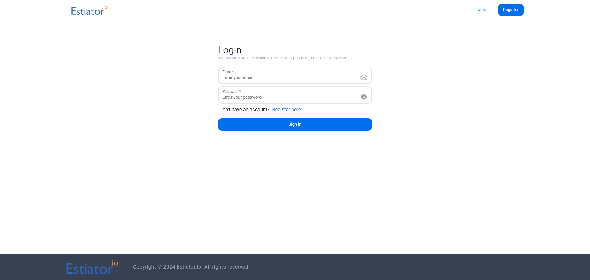
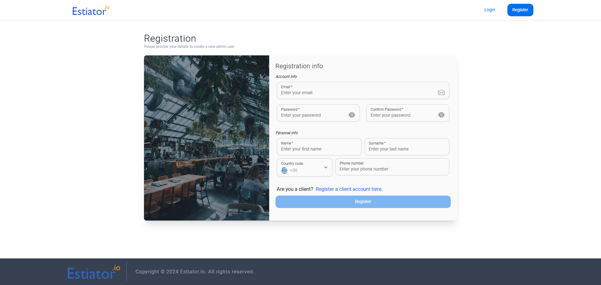
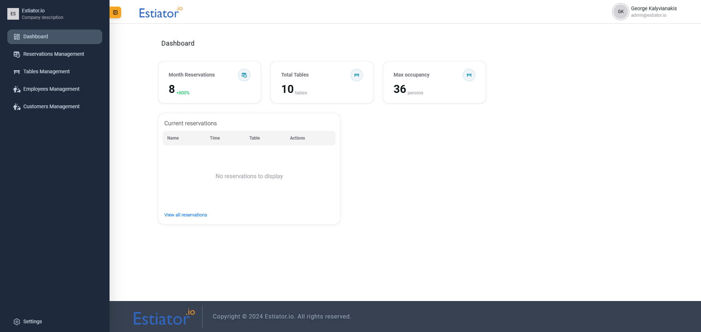
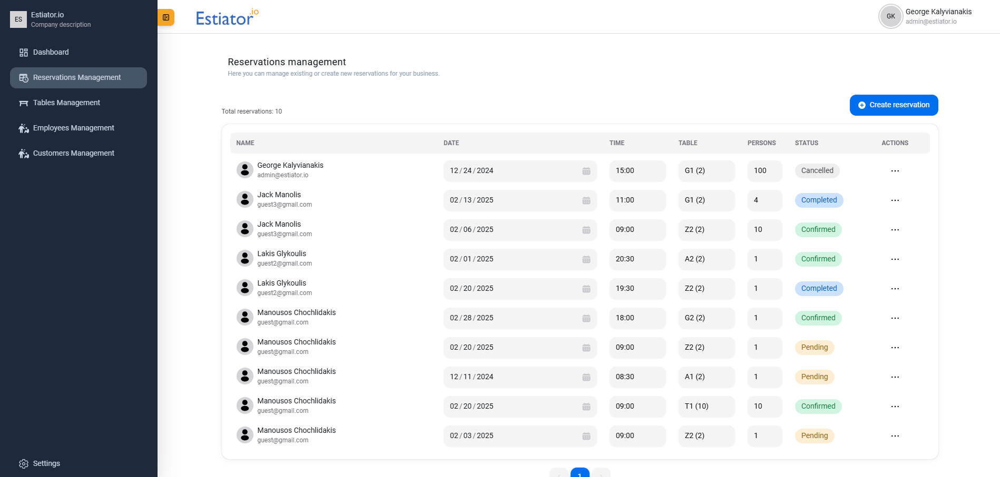
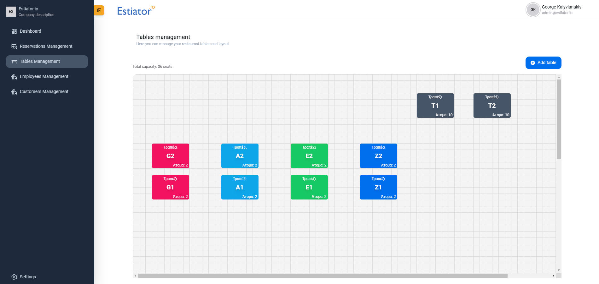
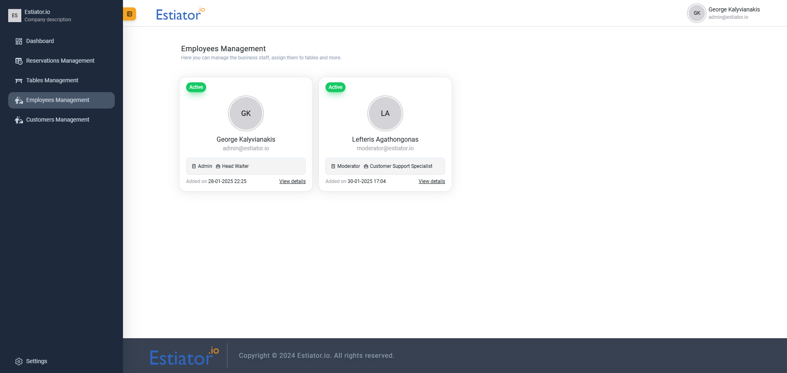
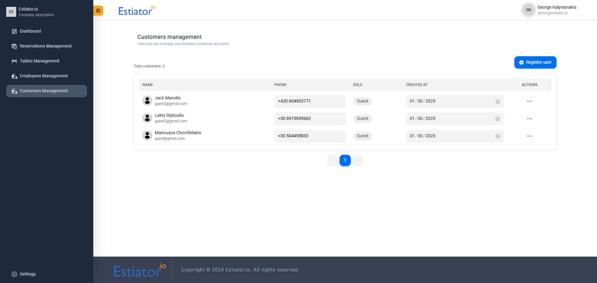

<div align="center">
  <a href="https://estiator.io" target="_blank">
    
  </a>

  <h3>The Open Source Management Platform for F&B Businesses</h3>

  <p>
    A full-stack web application offering a complete management solution for Restaurants 
    and Food & Beverage businesses. Developed as part of a Master's Thesis.
  </p>
</div>

> [!CAUTION]
> **Not Production Ready**: This is an academic prototype containing known architectural and security limitations. It is strictly for educational and demonstration purposes only. **Do not use this application in a production environment.**


<div align="center">

  
  
  
  
  
  
  <br/>

  
  
  

</div>

<br />

## 📖 Table of Contents

- [Tech Stack](#-tech-stack)
- [Getting Started (Docker)](#-getting-started-docker)
- [Development Setup (Manual)](#-development-setup-manual)
- [Testing & Credentials](#-testing--credentials)
- [Gallery](#-gallery)

---

## 🛠 Tech Stack

This project uses a modern full-stack architecture, separating the client and server responsibilities.

| Component | Technology | Version | Description |
| :--- | :--- | :--- | :--- |
| **Client** | [React](https://react.dev/) | 18.3 | Frontend UI library |
| | [HeroUI](https://www.heroui.com/) | 2.6 | Component library (NextUI fork) |
| | [Tailwind CSS](https://tailwindcss.com/) | 3.4 | Utility-first CSS framework |
| | [TypeScript](https://www.typescriptlang.org/) | 5.6 | Statically typed JavaScript |
| **Server** | [Java](https://www.java.com/) | 21 | Core language |
| | [Spring Boot](https://spring.io/projects/spring-boot) | 3.3 | Backend framework |
| **Data** | [MySQL](https://www.mysql.com/) | 8.0 | Relational database |

<br />

## 🐳 Getting Started (Docker)

The application is fully containerized. You can run the entire stack (Client, Server, Database) with a single command.

### Prerequisites
* **Docker Desktop** (Download [here](https://www.docker.com/products/docker-desktop/))

### Environment Setup

Before running Docker, create the two required configuration files:

| File | Template | Description |
| :--- | :--- | :--- |
| `database.env` | `example.database.env` | MySQL credentials used by the database container |
| `server/.env` | `example.server.env` | JWT secret, SSL keystore password, SMTP settings, etc. |

Copy each template to its target location and fill in your values.

### Option A: Build from Source
Use this method if you want to contribute or modify the code.

1.  **Clone the repository**
    ```bash
    git clone https://github.com/CptGeo/estiator
    cd estiator
    ```

2.  **Set up configuration files** (see [Environment Setup](#environment-setup) above)

3.  **Build and run**
    ```bash
    docker compose up --build
    ```

### Option B: Standalone (No Source Required)
You only need three files to run the application — no need to clone the full repository.

1.  **Create the following directory structure:**
    ```text
    ├── docker-compose.yml   ← download from the repository root
    ├── database.env         ← copy from example.database.env and fill in values
    └── server/
        └── .env             ← copy from example.server.env and fill in values
    ```

2.  **Pull and run** (Docker pulls the pre-built images automatically):
    ```bash
    docker compose up
    ```

### What Runs

Docker starts three containers:

| Container | Description |
| :--- | :--- |
| `app-database` | MySQL 8 — pre-populated with schema and seed data |
| `app-server` | Spring Boot REST API on HTTPS port 8443 |
| `app-client` | React frontend served on port 80 |

Once all containers are healthy, open the app at: **[http://localhost](http://localhost)**

<br />

## 💻 Development Setup (Manual)

Follow these steps to run the application locally without Docker.

### Prerequisites

| Tool | Required Version |
| :--- | :--- |
| Node.js | 20+ |
| JDK | 21 |
| MySQL | 8 |
| Git | any |

### 1. Database Setup

Import the init script into your local MySQL server. This creates the `estiator` database and populates it with seed data automatically:

```bash
mysql -u root -p < database/db-init.sql
```

Alternatively, import `database/db-init.sql` using a GUI tool such as MySQL Workbench or DBeaver.

### 2. Server Setup

1.  **Configure properties:**
    Open `server/src/main/resources/application.properties` and update your database credentials and JWT secret:
    ```properties
    # Database Configuration
    spring.datasource.url=jdbc:mysql://localhost:3306/estiator
    spring.datasource.username=root
    spring.datasource.password=YOUR_PASSWORD

    # Security (Base64-encoded string, min. 256 bits)
    app.jwt-secret=YOUR_SECRET_KEY
    ```

2.  **Start the server:**
    From the `server` directory, run:
    ```bash
    ./gradlew bootRun
    ```
    The API will be available at **https://localhost:8443**.

### 3. Client Setup

From the `client` directory, run:

```bash
npm install
npm run dev
```

The frontend will start at **http://localhost** (port 80).

<br />

## 🔐 Testing & Credentials

The database is pre-populated with the following user accounts for demonstration purposes.

| Email | Password | Role | Access Level |
| :--- | :--- | :--- | :--- |
| `admin@estiator.io` | `12341234` | **Admin** | Full system access, including employee management and all delete operations |
| `moderator@estiator.io` | `12341234` | **Moderator** | Admin dashboard access (reservations, tables, customers, settings) — no employee management or delete operations |

<br />

## 📸 Gallery

<details>
  <summary><strong>Click to expand application screenshots</strong></summary>
  <br />

  <h4>Login Page</h4>
  
  <br /><br />

  <h4>Register Page</h4>
  
  <br /><br />

  <h4>Dashboard</h4>
  
  <br /><br />

  <h4>Reservations Management</h4>
  
  <br /><br />

  <h4>Tables Management</h4>
  
  <br /><br />

  <h4>Employees Management</h4>
  
  <br /><br />

  <h4>Customers Management</h4>
  

</details>
